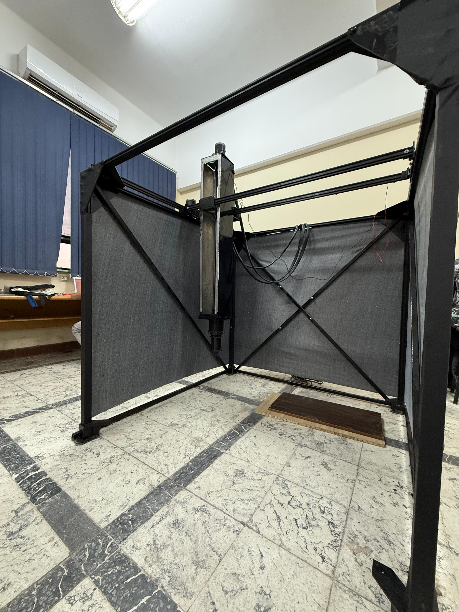

# 🏗️ 3D Concrete Printer
My graduation project was a 3D Concrete Printing (3DCP) machine capable of fabricating complex concrete structures in three dimensions, similar to the way conventional 3D printers work with plastic. The system was designed to automate the layer-by-layer deposition of concrete material, creating intricate geometries efficiently and accurately.      
It integrates a **desktop application** for G-code preparation and an embedded control firmware running on an **STM32 microcontroller**. Together, these components enable precise, reliable, and fully automated additive manufacturing of concrete structures.

---

## 🎯 Project Objectives

- Develop an embedded system for accurate motion control of the concrete printing mechanism.
- Create a desktop application to translate user-generated G-code into printer-specific instructions.
- Ensure reliable, deterministic operation by avoiding runtime communication during printing.

---

## 🖥️ Desktop Application

The desktop application acts as a **bridge between user-generated G-code and the embedded firmware**. Its responsibilities include:

- **G-code Parsing**  
  - Read and interpret G-code files to extract geometric paths, extrusion rates, and printing parameters.
- **Instruction Generation**  
  - Convert standard G-code commands into a custom instruction set optimized for the embedded controller.
- **User Interface**  
  - Provide an intuitive interface for:
    - Loading and previewing G-code files.
    - Configuring printer settings.
    - Monitoring preparation steps.
- **Communication Strategy**  
  - To **eliminate potential communication failures** during sensitive motion operations, the system **does not rely on live data transmission** while printing. Instead, prepared instructions are transferred in advance to the embedded system.

---

## ⚙️ Embedded Firmware

The embedded firmware is developed for the **STM32F401CCU6 microcontroller** and is responsible for:

- Interpreting pre-generated instructions from the desktop application.
- Controlling stepper motors to execute precise movements in X, Y, and Z axes.
- Managing extrusion mechanisms to ensure consistent material flow.
- Coordinating motion sequences to construct the target structure layer by layer.

---

## 🛠️ Hardware Components

- **Microcontroller**: STM32F401CCU6
- **Motion System**: Stepper motors with drivers
- **Extruder**: Concrete extrusion system (custom design)
- **Mechanical Frame**: Cartesian Robot for 3-axis motion control

*Note: Detailed mechanical designs, electrical schematics, and BOM are included in the `hardware/` directory.*

---

## 🚀 Getting Started

### 1️⃣ Build the Desktop Application
- Navigate to `/software`
- Follow the instructions in the README to compile or run

### 2️⃣ Flash the Firmware
- Navigate to `/firmware`
- Use STM32CubeProgrammer or your preferred tool to flash the binary

### 3️⃣ Prepare Instructions
- Load your G-code in the desktop app
- Generate printer instructions
- Transfer to the embedded controller (via SD card or pre-loading)

### 4️⃣ Start Printing
- Power on the system
- The embedded firmware will autonomously execute the instructions

---

## 💡 Why No Live Communication?

During development, we determined that **live communication posed unacceptable risk of packet loss or delays**, potentially compromising structural integrity. By pre-loading all instructions before the print begins, we ensure deterministic operation and maximum reliability.

---

## 📸 Media

  

*More photos and videos are available in the `images/` and `Videos/` folders.*

---

## 🛠️ Future Improvements

While this project demonstrates a functional 3D concrete printing system, there are several areas for further development:

- **Web-Based Interface:**  
  Implement a web application to enable remote preparation, transfer, and management of print jobs over the air.

- **Live Monitoring and Telemetry:**  
  Add real-time monitoring of printer status, position, and extrusion parameters to improve reliability and user feedback.

- **Error Detection and Recovery:**  
  Incorporate sensors and logic for automatic error detection, such as clog detection or layer misalignment, with the ability to pause and resume printing safely.

- **Enhanced Safety Features:**  
  Develop additional safeguards for emergency stops, environmental monitoring, and system diagnostics.
